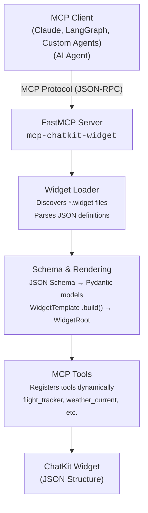

# ChatKit Widget MCP Server

[](https://github.com/ShaojieJiang/mcp-chatkit-widget/actions/workflows/ci.yml?query=branch%3Amain)
[](https://coverage-badge.samuelcolvin.workers.dev/redirect/ShaojieJiang/mcp-chatkit-widget)
[](https://pypi.python.org/pypi/mcp-chatkit-widget)
[](https://www.python.org/downloads/)

A Model Context Protocol (MCP) server that **automatically** transforms ChatKit Studio widget definitions into callable MCP tools, enabling AI agents to dynamically generate rich, interactive UI components that can be rendered in the ChatKit UI.


## Purpose

`mcp-chatkit-widget` bridges the gap between static UI component definitions and runtime tool invocation for AI agents. It automatically converts [ChatKit Studio](https://chatkit.studio/) `.widget` files into MCP tools that agents can call to generate interactive widgets.

### Key Features

- **Automatic Tool Generation**: Converts every `.widget` file into an MCP tool with type-safe input validation
- **Dynamic Schema Conversion**: Transforms JSON Schema definitions into Pydantic models for runtime validation
- **Template Rendering**: Uses Jinja2 to render widget templates with validated data
- **Rich Widget Library**: Includes 16 pre-built widgets from ChatKit Studio's gallery (flight tracker, weather, email composer, etc.), extendable with custom widgets
- **Type Safety**: Full type annotations and validation using Pydantic v2
- **Curated Discovery Guardrails**: Requires passing an explicit `widgets_dir` so only
  curated definitions are discovered and registered, preventing accidental loads
  from arbitrary paths

### How It Works

1. **Widget Discovery**: Requires the CLI `--widgets-dir` argument to point at the curated
   directory; loading fails fast if the argument is missing or invalid.
2. **Schema Parsing**: Extracts JSON Schema and Jinja2 templates from widget definitions
3. **Model Generation**: Creates dynamic Pydantic models for input validation
4. **Tool Registration**: Registers MCP tools with FastMCP server
5. **Runtime Execution**: Validates inputs, renders templates, and returns ChatKit widget components

## Installation

### From PyPI

```bash
uv add mcp-chatkit-widget
```

### From Source (Development)

```bash
# Clone the repository
git clone https://github.com/ShaojieJiang/mcp-chatkit-widget.git
cd mcp-chatkit-widget

# Install with uv (recommended)
uv sync --all-groups

# Or with pip
pip install -e ".[dev,docs]"
```

### Requirements

- Python 3.12 or higher
- [FastMCP](https://github.com/jlowin/fastmcp) >= 2.13.0.2
- [OpenAI ChatKit](https://pypi.org/project/openai-chatkit/) >= 1.1.0

## Usage

### Running the MCP Server

Start the server with the required `--widgets-dir` argument that points to your curated
widget directory:

```bash
uv run mcp-chatkit-widget --widgets-dir /path/to/widgets
```

Point to `examples/widgets` to expose the built-in definitions or supply your own
curated `.widget` directory.

### Integrating with MCP Clients

#### Claude Desktop

Add the server to your Claude Desktop configuration (`claude_desktop_config.json`):

```json
{
  "mcpServers": {
    "chatkit-widget": {
      "command": "/path/to/uvx",
      "args": [
        "--from",
        "mcp-chatkit-widget@latest",
        "mcp-chatkit-widget",
        "--widgets-dir",
        "/path/to/widgets"
      ]
    }
  }
}
```

#### LangGraph Agents

```python
from langgraph.prebuilt import create_react_agent
from mcp import ClientSession, StdioServerParameters
from mcp.client.stdio import stdio_client

# Connect to the MCP server
server_params = StdioServerParameters(
    command="mcp-chatkit-widget",
    args=[]
)

async with stdio_client(server_params) as (read, write):
    async with ClientSession(read, write) as session:
        # Initialize session
        await session.initialize()

        # List available tools
        tools_result = await session.list_tools()
        print(f"Available widgets: {[tool.name for tool in tools_result.tools]}")

        # Create agent with widget tools
        agent = create_react_agent(model, tools=tools_result.tools)
```

#### Direct Tool Invocation

```python
from pathlib import Path

from mcp_chatkit_widget.server import register_widget_tools, server

# Load the curated widgets directory so the FastMCP tool manager
# knows about the bundled widget tools before invocation.
widgets_dir = Path(__file__).resolve().parents[1] / "examples" / "widgets"
register_widget_tools(widgets_dir)

# Example: Generate a flight tracker widget
flight_widget = server.call_tool(
    "flight_tracker",
    arguments={
        "number": "PA 845",
        "date": "Fri, Apr 25",
        "progress": "60",
        "airline": {
            "name": "Pan American Airways",
            "logo": "/panam_logo.png"
        },
        "departure": {
            "airport": "SFO",
            "city": "San Francisco",
            "time": "10:30 AM"
        },
        "arrival": {
            "airport": "JFK",
            "city": "New York",
            "time": "7:45 PM"
        }
    }
)

# `result.content[0].text` is the JSON string of the ChatKit WidgetComponentBase instance
print(result.content[0].text)
```

### Importable Helpers

The package exports helpers so scripts, demos, and tests can reuse the same
rendering pipeline without running the full MCP server.

- `load_widgets(widgets_dir: Path)` enforces the curated directory, loads `.widget`
  files, and raises when the path is missing, invalid, or contains malformed
  templates.
- `render_widget_definition(widget_def, **kwargs)` validates inputs against the
  schema-backed Pydantic model, renders the stored template, and returns a
  `WidgetComponentBase` that mirrors the preview payload.
- `generate_widget_tools(server, widget_defs)` registers sanitized tools on your
  FastMCP-like server so you can reuse the same helpers elsewhere.

```python
from pathlib import Path

from mcp_chatkit_widget import (
    generate_widget_tools,
    load_widgets,
    render_widget_definition,
)

widgets = load_widgets(Path("/path/to/widgets"))
widget = render_widget_definition(widgets[0], title="Hello")

# Optionally wire the helpers into your own FastMCP server.
generate_widget_tools(custom_server, widgets)
```

### Inspecting tool output

FastMCP returns the JSON emitted by the widget template's `.build()` helper, so the response already matches the ChatKit schema. Scripts such as `examples/run_widget/run_widget.py` show how to print that JSON and summarize it via `display_widget_payload`. There is no need to instantiate ChatKit classes manually—the helpers always re-render widgets through `render_widget_definition`, so the payload you see is the canonical structure the server would send to agents.

### Available Widgets

The server includes 16 pre-built widgets:

- **Communication**: Channel Message, Draft Email
- **Travel**: Flight Tracker, Ride Status
- **Events**: Create Event, View Event, Event Session
- **Tasks**: Create Task, Enable Notification
- **Entertainment**: Player Card, Playlist
- **Weather**: Weather Current, Weather Forecast
- **Shopping**: Purchase Complete, Software Purchase, Purchase Items

Each widget automatically becomes an MCP tool named in `snake_case` (e.g., "Flight Tracker" → `flight_tracker`).

### Adding Custom Widgets

1. Export a `.widget` file from [ChatKit Studio](https://chatkit.openai.com/)
2. Place the `.widget` file into a curated directory that you control
3. Start the MCP server with `--widgets-dir` pointing to that directory

The loader only inspects the directory passed via `--widgets-dir`, so all
discovered widgets are explicitly approved by your deployment workflow. Use
`examples/widgets` as the argument when you want to boot the packaged
definitions, or swap in a custom directory to opt in to bespoke widgets.

## Architecture



### Data Flow

1. **Startup**: Server discovers all `.widget` files
2. **Registration**: Each widget becomes an MCP tool with validated schema
3. **Invocation**: Agent calls tool with parameters
4. **Validation**: Pydantic model validates input data
5. **Rendering**: Jinja2 template renders with validated data
6. **Construction**: `render_widget_definition` invokes the template's `.build()` so the rendered JSON becomes a `WidgetRoot` that matches the preview hierarchy
7. **Return**: Widget instance sent back to agent

## Development

### Running Tests

Always lint and test through the project-managed environment before merging:

```bash
# Run linting and type checking
uv run make lint

# Run all tests with coverage
uv run make test
```

You can run targeted tests directly when experimenting:

```bash
pytest tests/test_server.py
pytest -v tests/
```

### Code Quality

```bash
# Run linting and type checking
uv run make lint

# Auto-format code
uv run make format

# Type check only
uv run mypy mcp_chatkit_widget/
```

### Building Documentation

```bash
# Serve documentation locally
uv run make doc

# Documentation will be available at http://0.0.0.0:8080
```

## Project Layout

```
mcp-chatkit-widget/
├── mcp_chatkit_widget/
│   ├── __init__.py
│   ├── server.py            # FastMCP server entrypoint
│   ├── widget_loader.py     # Discovers .widget files
│   ├── schema_utils.py      # JSON Schema → Pydantic helpers
│   ├── pydantic_conversion.py  # Schema conversion helpers
│   ├── rendering.py         # Jinja rendering helpers
│   ├── tooling.py           # MCP tool registration utilities
│   ├── naming.py            # Widget ⇄ tool name helpers
│   └── py.typed
├── examples/
│   ├── run_widget/          # Sample rendering scripts
│   └── widgets/             # Packaged widget definitions
├── custom_widgets/          # Optional curated widget sources
├── docs/
│   ├── release-notes.md
│   └── plan.md
├── tests/
│   ├── test_server.py
│   ├── test_tooling.py
│   ├── test_rendering.py
│   ├── schema_utils/
│   ├── widget_loader/
│   └── widget_integration/
├── Makefile
├── mkdocs.yml
├── pyproject.toml
├── uv.lock
├── langgraph.json
├── LICENSE.txt
└── README.md
```

## Contributing

Contributions are welcome! Please:

1. Fork the repository
2. Create a feature branch (`git checkout -b feature/amazing-feature`)
3. Run tests and linting (`make test && make lint`)
4. Commit your changes (`git commit -m 'Add amazing feature'`)
5. Push to the branch (`git push origin feature/amazing-feature`)
6. Open a Pull Request

## License

This project is licensed under the MIT License - see the [LICENSE.txt](LICENSE.txt) file for details.

## Resources

- [ChatKit Studio](https://chatkit.studio/) - Create and export widget definitions
- [Model Context Protocol](https://modelcontextprotocol.io/) - MCP specification
- [FastMCP](https://github.com/jlowin/fastmcp) - High-level MCP server framework
- [OpenAI ChatKit Python SDK](https://pypi.org/project/openai-chatkit/) - Widget component library

## Support

- **Issues**: [GitHub Issues](https://github.com/ShaojieJiang/mcp-chatkit-widget/issues)
- **Documentation**: [docs/](docs/)
